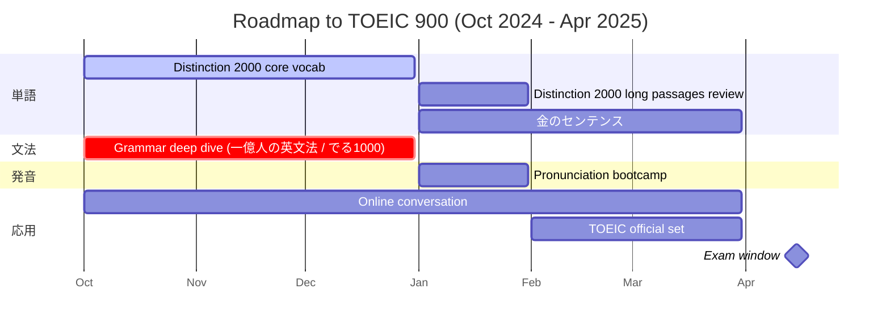

# TOEIC 900 Challenge

2025年4月に TOEIC 900 点を突破するための公開学習ログ

## 🎯 Goals
- 2025年4月の本番試験で TOEIC 900 点を達成する
- TOEIC を定量指標として活用しつつ、英会話力の向上をより大きなゴールに据える

## 🧭 Guiding Principles
- 試験テクニック偏重の「スコアハック」は行わず、言語運用能力の底上げを優先
- 学習ログを公開し、外部からの視線でタスク達成を後押しできるか検証する
- データで進捗を可視化し、継続を仕組み化する

## 📊 今日のKPI
<!--KPIS-->
集計スクリプト `scripts/summary.py` がここを書き換えます。
<!--/KPIS-->

## 🛠️ How It Works
1. 毎日 GitHub Issue フォーム「Daily Log」から学習実績を入力します。
2. 入力内容は `logs/daily.csv` に追記されます（数値入力、日付は `YYYY-MM-DD`）。
3. `scripts/summary.py` が KPI を計算し、README と投稿文テンプレートを更新します。
4. GitHub Actions が以下のタイミングで自動集計を実行します。
   - 日次 Issue が作成されたとき
   - 毎晩 JST 21:30 の定期実行
5. 必要に応じて `scripts/tweet.py` で X へ自動投稿、Slack 通知にも対応予定です。

## 📂 Repository Layout
```
toeic-900-challenge/
├─ README.md
├─ logs/
│  └─ daily.csv
├─ scripts/
│  ├─ summary.py
│  └─ tweet.py
└─ .github/
   ├─ ISSUE_TEMPLATE/
   │  └─ daily.yml
   └─ workflows/
      ├─ on-daily-issue.yml
      └─ nightly-recalc.yml
```

## 🚀 Getting Started
- 日次入力を始める前に `logs/daily.csv` にヘッダー行を用意しておきます。
- 自動投稿を使う場合は以下の Secrets を GitHub リポジトリに設定してください。
  - `X_API_KEY`, `X_API_SECRET`, `X_ACCESS_TOKEN`, `X_ACCESS_SECRET`
  - `SLACK_WEBHOOK_URL`（任意）
- Poetry や pipenv など任意の方法で `scripts/` が依存するライブラリをセットアップしてください。

## 🧪 Automation Details
- `summary.py`
  - 日次・週次の実行量、完全理解数、進捗率、90日到達予測を算出
  - README の KPI セクションを更新
- GitHub Actions
  - `on-daily-issue.yml`: 日次 Issue 作成トリガーで `summary.py` を実行
  - `nightly-recalc.yml`: JST 21:30 のスケジュールで再集計
- `tweet.py`
  - README から直近 KPI を取得し、X への投稿文を生成（自動 or ワンクリック）

## ✅ 運用チェックリスト
- [ ] 毎日 Issue 「Daily Log」から入力したか？
- [ ] KPI が README に反映されているか？
- [ ] 週次の進捗率・予測を確認したか？
- [ ] X / Slack への共有を済ませたか？

## 📌 Roadmap Ideas
- 週次 KPI グラフ（PNG）自動生成
- Slack 通知や note への週次まとめテンプレート生成
- 入力漏れ検出とリマインダー発火

## 🗺️ Roadmap to April 2025
`roadmap.md` をもとに、今日から 4 月の本番までの重点テーマを可視化しました。



- **1〜2月**: 文法と語彙を徹底的に固め、発音ルールを体系化。
- **3月**: 公式問題集を回し込み、リスニング・リーディング両セクションの弱点をログ化。
- **4月**: 模試と誤答分析で仕上げつつ、コンディション調整と英会話量を維持して本番へ。

## 🧠 Why This Matters
学習の積み上げを「数値で見える化」し、公開ログが継続力を高めるか検証します。TOEIC は成長を測る定量指標のひとつであり、真のゴールは英会話で自在に意思疎通できる状態です。外部への発信とデータドリブンな振り返りを組み合わせ、4月の 900 点達成とその先の英語運用力向上を目指します。

## 📄 License
MIT License（予定）。プロジェクトに合わせて適宜更新してください。
